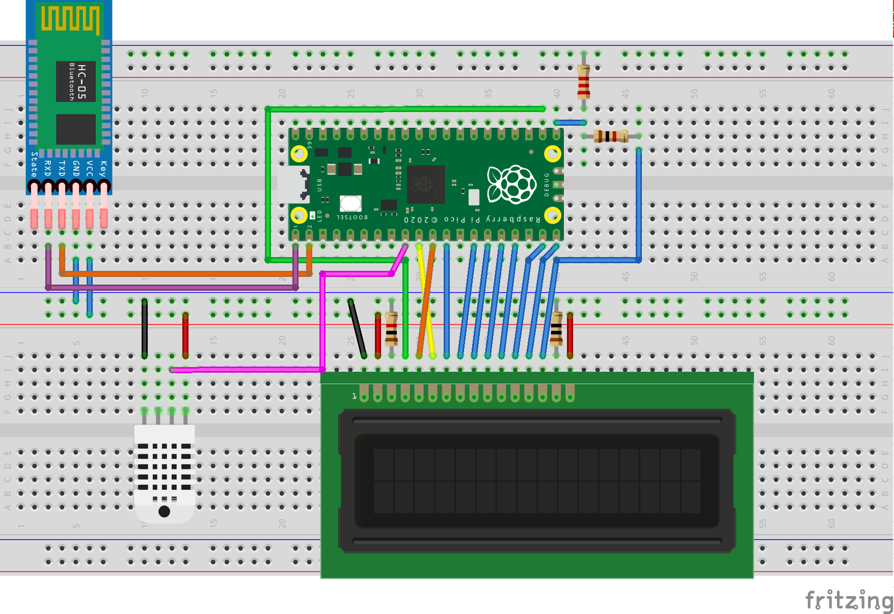

# DHT22

This project is an amalgamation of my other 16x2 LCD projects with the addition of a DHT22 temperature / humidity sensor driver. It does the following:

- Queries the DHT22 sensor and converts sensor data to a readable format
- Displays said data on a generic 16x2 LCD display
- Listens for requests on the UART and returns current data based on request 

# Components

`lcd.pio` handles sending data to and from the LCD display. A busy flag check is implemented which means no delays are required when writing consecutive commands to the display.

`dht22.pio` handles data requests and retrievals from the DHT22 module. Fifo joining is utilised to simplify the program loop at the cost of having to trigger subsequent runs via a jump instruction.

`dht22.h` is a simple wrapper library that triggers sensor retrieval and fills a provided buffer with data

`lcd.h` is a wrapper library that aligns and writes strings to the LCD module

# Schematic

# LCD Pinout

| LCD | GPIO | Description     |
|-----|------|-----------------|
| 6   | 7    | Enable          | 
| 5   | 8    | Read/Write      | 
| 7   | 9    | DB0             | 
| 8   | 10   | DB1             | 
| 9   | 11   | DB2             | 
| 10  | 12   | DB3             | 
| 11  | 13   | DB4             | 
| 12  | 14   | DB5             | 
| 13  | 15   | DB6             | 
| 14  | 16   | DB7             | 
| 4   | 17   | Register Select | 

# Notes
## Voltage divider
The Raspberry Pi Pico is a 3v3 device. The generic LCD module I used in this build is rated for 5v. This isn't a problem when we are outputting to the LCD module but DB7 is an exception as it becomes an input when reading the busy flag. 

As pictured, a 2k2 resistor from GPIO16 to GND and a 1k resistor from GPIO16 to LCD14 brings the voltage down to a safe level.

## Instructions
The example contains a subset of the possible commands accepted by the display, for a full list you should search out the HD44780U data sheet.
