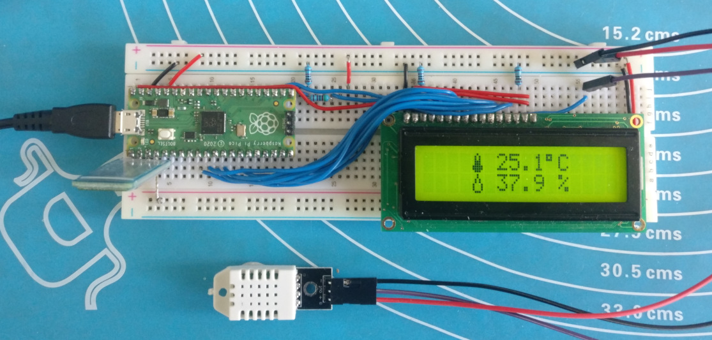

# DHT22

This project is an amalgamation of my other 16x2 LCD projects with the addition of a DHT22 temperature / humidity sensor driver. It does the following:

- Queries the DHT22 sensor and converts sensor data to a readable format
- Displays said data on a generic 16x2 LCD display
- Listens for requests on the UART and returns current data based on request 

# Serial usage

Currently the serial console listens for two commands. Commands must be sent with a trailing `\r` to be recognised by the program, some serial terminals send this character by default:

|Command| Example response |Description|
|-------|------------------|-----------|
|`TMP`    |OK25.1              |Last temperature reading|
|`HUM`    |SE37.9              |Last humidity reading|

The response provided by the pico conforms to the following format:

`XXYY.Y`

Where `YY.Y` is the last successful reading taken from the sensor and `XX` is one of the following status codes:

|Code|`YY.Y` inline |Description|
|----|------------|-----------|
|OK  |Yes         |Okay, the last communication attempt with the DHT22 module was successful|
|SE  |Yes         |Sensor error, the last communication attempt with the DH22 module failed|
|BR  |No          |Bad request, the serial command was not recognised|

# Software Components

`lcd.pio` handles sending data to and from the LCD display. A busy flag check is implemented which means no delays are required when writing consecutive commands to the display.

`dht22.pio` handles data requests and retrievals from the DHT22 module. Fifo joining is utilised to simplify the program loop at the cost of having to trigger subsequent runs via a jump instruction.

`dht22.h` is a simple wrapper library that triggers sensor retrieval and fills a provided buffer with data

`lcd.h` is a wrapper library that aligns and writes strings to the LCD module

# Hardware Components

- 1602m generic 16x2 LCD module
- HC-06 bluetooth serial module
- DHT22* temperature / humidity monitor

*NOTE: If DHT22 does not come attached to a board then the module must have a 10kΩ resistor between vcc and data pins.

# Pico connections
<table>
<tr>
    <th>LCD</th><th>HC-06</th><th>DHT22</th>
</tr>
<tr>
<td style='vertical-align: top;'>

| Module | GPIO | Description  |
|-----|------|-----------------|
| 6   | 7    | Enable          | 
| 5   | 8    | Read/Write      | 
| 7   | 9    | DB0             | 
| 8   | 10   | DB1             | 
| 9   | 11   | DB2             | 
| 10  | 12   | DB3             | 
| 11  | 13   | DB4             | 
| 12  | 14   | DB5             | 
| 13  | 15   | DB6             | 
| 14  | 16   | DB7             | 
| 4   | 17   | Register Select | 

</td>
<td style='vertical-align: top;'>

|Module|GPIO| 
|--|--|
|txd|2|
|rxd|1|

</td>
<td style='vertical-align: top;'>

| Module | GPIO |
|-----|------|
| data   | 6    |

</td>

</tr>
</table>

# Schematic

# Notes
## Voltage divider
The Raspberry Pi Pico is a 3v3 device. As shown in the schematic the dht22 and hc-06 modules run absolutely fine on 3.3v. 

However the generic LCD module used in this build is rated for 5v. This isn't a problem when we are outputting to the LCD module as it is tolerant of 3v3 signals but DB7 is a problem as it becomes an input when reading the busy flag. 

To mitigate this a voltage divider is added between DB7 and GPIO16, pictured above. A 2k2 resistor from GPIO16 to GND and a 1k resistor from GPIO16 to DB7 (LCD pin 14) brings the voltage down to a safe level.
