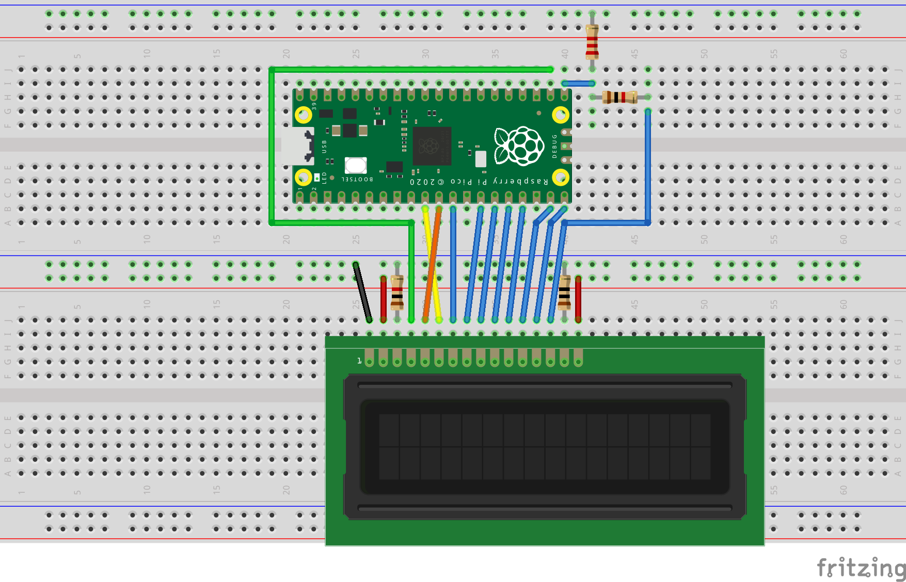

# LCD Animation

The following is an example program for a 16x2 generic LCD display. It does the following:

- Write a multi-character icon set to the displays CGRAM
- Display the icon set
- Change certain icons to produce next animation frame
- Display the icon set
- Repeated for a 4 frame animation cycle

The result is an animated coffee icon.
  
`lcd.pio` handles sending data to and from the LCD display. A busy flag check is implemented which means no delays are required when writing consecutive commands to the display.

# Pinout

| LCD | GPIO | Description     |
|-----|------|-----------------|
| 6   | 7    | Enable          | 
| 5   | 8    | Read/Write      | 
| 7   | 9    | DB0             | 
| 8   | 10   | DB1             | 
| 9   | 11   | DB2             | 
| 10  | 12   | DB3             | 
| 11  | 13   | DB4             | 
| 12  | 14   | DB5             | 
| 13  | 15   | DB6             | 
| 14  | 16   | DB7             | 
| 4   | 17   | Register Select | 

# Schematic

# Notes
## Voltage divider
The Raspberry Pi Pico is a 3v3 device. The generic LCD module I used in this build is rated for 5v. This isn't a problem when we are outputting to the LCD module but DB7 is an exception as it becomes an input when reading the busy flag. 

As pictured, a 2k2 resistor from GPIO16 to GND and a 1k resistor from GPIO16 to LCD14 brings the voltage down to a safe level.

## Instructions
The example contains a subset of the possible commands accepted by the display, for a full list you should search out the HD44780U data sheet.

## Known Issues

Writing out the `Clear display` command  will **stall the display**. For whatever reason the display, at least in my case, will report a constant busy state, stalling the program. This can be worked around by issuing a `Return home` command instead and being careful to clear the display of residual characters when required.