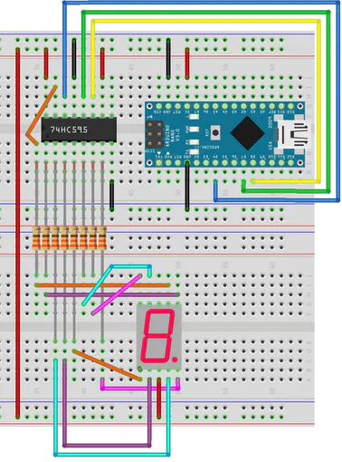

# shift register

This little program rotates through an array of characters, pushing them out to a 74hc595 shift register which controls the behaviour of a 7 segment display (5161BS).

A push button will additionally toggle movement through the array.

Wiring guide used, minus the button:

